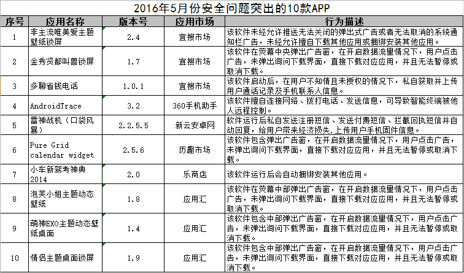
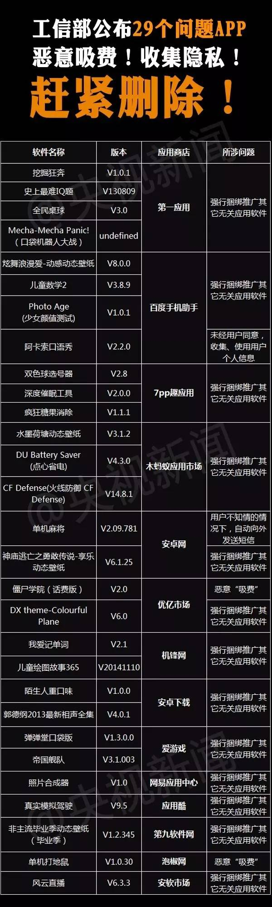

### 国家互联网安全中心【恶意代码】

1.[关于近期“相册”类安卓恶意程序监测处置情况的通报](关于近期“相册”类安卓恶意程序监测处置情况的通报) 2016-04-29

国家互联网应急中心（以下简称“CNCERT”）持续对通过短信传播、且具有窃取用户短信和通讯录等恶意行为的“相册”类安卓恶意程序进行监测。近期，我中心监测发现该类恶意程序变种5424个，恶意传播该类恶意程序的URL链接3456个、恶意域名1510个，用于接收用户短信和通讯录的恶意邮箱账户1364个，用于接收用户短信的恶意手机号1182个，泄露用户短信和通讯录邮件56万封，累计感染用户超过20万人，对用户信息安全造成严重的安全威胁。CNCERT第一时间对该类恶意程序的传播地址、恶意邮箱进行处置，有效控制了恶意程序的影响范围。

*  恶意程序的行为分析 
*  恶意程序所使用的邮箱统计 
*  恶意程序所使用的手机号统计
*  处理措施（附录了恶意程序的名称）

   
2.[关于安卓视频恶意程序处置的有关情况通报](关于安卓视频恶意程序处置的有关情况通报) 2016-03-11 

 2016年3月8日，国家互联网应急中心（以下简称“CNCERT”）接到投诉，一款通过短信传播的安卓“视频”恶意程序大量传播。该病毒私自窃取用户通讯录， CNCERT第一时间对该批恶意域名进行处置，有效控制了恶意程序的影响范围。

* 恶意程序机理分析情况 

 该恶意程序伪装成“视频”APP，通过伪基站或者手机肉鸡以短信方式进行传播，短信内容为“XXX，我是XXX，这是我帮你拍的小视频 df.tc/3XQGdf”。

*  处置措施

3.[关于安卓短信蠕虫病毒处置情况的有关情况通报](关于安卓短信蠕虫病毒处置情况的有关情况通报) 2016-03-01

2016年2月15日，国家互联网应急中心（以下简称“CNCERT”）接到CNCERT广东分中心、浙江分中心投诉，一款通过短信传播的安卓蠕虫病毒大量传播。该病毒私自读取用户通讯录，向联系人发送带有蠕虫病毒下载地址的恶意短信，诱骗联系人感染。通过对病毒下载地址的域名进行溯源分析，发现该域名注册人名下还有7个用于传播安卓恶意程序的域名， CNCERT第一时间对该批恶意域名进行处置，有效控制了恶意程序的影响范围。

* 恶意程序机理分析情况 

 该蠕虫病毒伪装成“检查更新”APP，通过伪基站或者手机肉鸡以短信方式进行传播，短信内容为“XXX，新年好。相片已经放到这上了 t.cn/RGfj6iM”。
  
 * 启动后会隐藏自身图标； 
 * 私自读取用户通讯录，向用户联系人群发包含蠕虫病毒下载地址的短信息。
* 影响范围分析 
* 处置措施

4.2015年5月份安全安问题突出的10款APP
  
 

5.[一种恶意程序专门攻击安卓](http://news.ifeng.com/a/20160710/49326402_0.shtml) 2016-07-10

据新华社电 国家计算机病毒应急处理中心通过对互联网的监测发现，近期出现一种针对安卓手机的恶意应用程序Godless。该恶意程序可以获取安卓手机的ROOT权限，会以不同的方式存在于互联网上的应用商店中。

国家计算机病毒应急处理中心专家分析发现，该恶意应用程序中包含了一些开源或者存在泄漏的安卓系统ROOT工具。一旦恶意应用程序获取系统的ROOT权限，就会在手机用户未授权的情况下远程访问并进行入侵攻击，导致手机系统中的数据被泄漏，短消息被窃取以及硬件出现使用故障等。针对已经感染该类恶意应用程序的计算机用户，专家建议立即升级手机中的防病毒软件，进行全面杀毒。

6.[恶意软件感染中印千万部安卓机 每月获利达200万](http://finance.sina.com.cn/roll/2016-07-09/doc-ifxtwitr1797414.shtml) 2016-07-09

HummingBad能够让网络罪犯获得受感染安卓设备的管理员权限。据CNET科技资讯网报道，这款恶意软件会在用户不知情的情况下下载应用和广告，每个月获得最多30万美元(约合200万元人民币)虚假广告收入。

7.[工信部提醒！这29个APP尽快删除！](http://finance.sina.com.cn/roll/2016-05-28/doc-ifxsqtya6386657.shtml) 2016-05-28  

 

